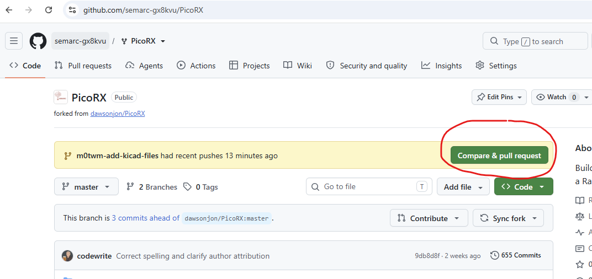

# How I added these files

From my laptop, I opened a powershell terminal and typed in the following commands:

```powershell
git clone git@github.com:semarc-gx8kvu/PicoRX.git
cd .\PicoRX\
git branch m0twm-add-kicad-files
git checkout m0twm-add-kicad-files
```

I then added the files in file explorer

Back in powershell, I executed the following commands:

```powershell
git add *
git commit -m 'Add schematics and pcb layouts'
git push --set-upstream origin m0twm-add-kicad-files
```

On the github website, the new branch automatically shows up and prompts you to submit a **pull request**:



