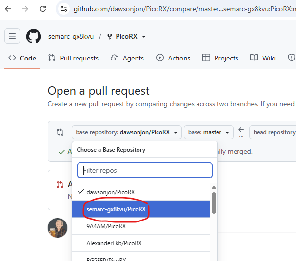

# How I added these files

From my laptop, I opened a powershell terminal and typed in the following commands:

```powershell
git clone git@github.com:semarc-gx8kvu/PicoRX.git
cd .\PicoRX\
git branch m0twm-add-kicad-files
git checkout m0twm-add-kicad-files
```

I then added the files in file explorer

Back in powershell, I executed the following commands:

```powershell
git add *
git commit -m 'Add schematics and pcb layouts'
git push --set-upstream origin m0twm-add-kicad-files
```

On the github website, the new branch automatically shows up and prompts you to submit a **pull request**:


On the next page, you get to name the pull request and set a description. Because this is a forked repository, you have to set the repository to the SEMARC one, because by default it will send a pull request to the base repository (jondawson) and you probbaly don't want that!



Admins get notified, and should approve the pull request as soon as possible. This is the standard approach and ensures that there are no conflicts. The files are now available on the main branch (which in this case is called master).
